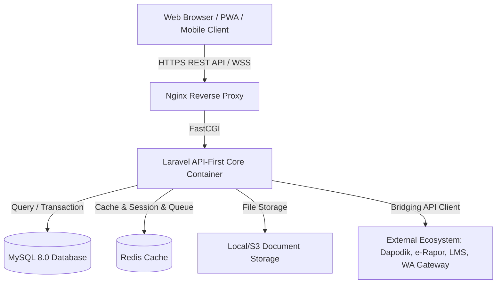
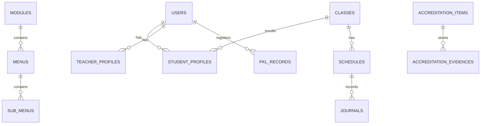

# 🎨 INFORA Design & Architecture Specification
> **Information Network for Organization, Records, & Accreditation**  
> *"Era Baru Sistem Informasi Sekolah Menengah (SMA & SMK)"*

---

## 1. 🌟 Ringkasan Eksekutif (Executive Summary)

**INFORA** adalah platform web Sistem Informasi Manajemen (SIM) sekolah menengah modern berbasis cloud yang dirancang untuk **SMA** dan **SMK**. INFORA menghadirkan ekosistem terpadu yang mengintegrasikan tata kelola akademik, kesiswaan, kepegawaian (GTK), hubungan industri & magang PKL (khusus SMK), hingga otomasi pemenuhan instrumen akreditasi sekolah unggul (BAN-SM / IASP).

---

## 2. 🎨 Identitas Visual & Desain Sistem (Brand & UI/UX System)

### 2.1. Brand Identity
- **Nama Platform:** INFORA
- **Tagline:** Era Baru Sistem Informasi Sekolah Menengah
- **Brand Personality:** Modern, Sleek, Intelligent, Reliable, Student & Teacher Friendly.

### 2.2. Palet Warna (Color Palette - Light, Friendly & High-Readability)
| Token | Kode Warna | Penggunaan |
| :--- | :--- | :--- |
| **Canvas Background** | `#F8FAFC` (Slate 50) | Latar belakang kanvas aplikasi yang tenang, sejuk, dan tidak menyilaukan |
| **Primary Surface** | `#FFFFFF` | Permukaan Card, Sidebar, Topbar, dan Elemen Konten Bersih |
| **Muted Surface** | `#F1F5F9` (Slate 100) | Secondary Button, Input Background, Area Hover Subtil |
| **Border / Divider** | `#E2E8F0` (Slate 200) | Garis batas komponen yang presisi, halus, dan elegan |
| **Brand Primary** | `#2563EB` (Royal Blue) | Tombol Utama, Identitas Brand Institusi, Highlight Utama |
| **Brand Cyan / Sky** | `#0284C7` (Sky Blue) | Gradien Aksen Brand (`#0284C7` ke `#2563EB`), Indikator Aktif |
| **Brand Soft Tint** | `#EFF6FF` (Blue 50) | Latar menu navigasi aktif, chip badge, dan seleksi data |
| **Success Emerald** | `#16A34A` / `#F0FDF4` | Status Verifikasi, Validasi Dokumen, Akun Aktif |
| **Warning Amber** | `#D97706` / `#FFFBEB` | Peringatan Kelengkapan Dokumen, Keterlambatan |
| **Danger Rose** | `#DC2626` / `#FEF2F2` | Pelanggaran Disiplin, Pesan Error, Peringatan Sistem |
| **Text Primary (Readability)** | `#0F172A` (Slate 900) | Teks Utama dengan kontras tajam (WCAG AAA) mudah dibaca guru & siswa |
| **Text Muted** | `#475569` (Slate 600) | Label Formulir, Sub-heading, Deskripsi Sekunder |
| **Text Dim** | `#64748B` (Slate 500) | Metadata, Placeholder, Timestamp |

### 2.3. Tipografi
- **Headings & Display:** `Plus Jakarta Sans` (Modern, geometric, tegas, ramah, dan bersahabat bagi sivitas sekolah).
- **Body & Data Tables:** `Inter` / `Plus Jakarta Sans` (Tingkat keterbacaan tinggi untuk tabel nilai, jurnal KBM, dan berkas akreditasi).
- **Monospace (ID Siswa/NISN/Kode):** `JetBrains Mono` / `Fira Code`.

### 2.4. Prinsip UI/UX & Arsitektur Layout
1. **Nuansa Terang, Halus & Bersih (*Bright, Smooth & Clean*):** Antarmuka dirancang dengan latar terang yang menyejukkan mata (*eye-friendly*), transisi halus, serta sangat ramah bagi penggunaan harian guru dan siswa tanpa memicu kelelahan visual (*visual fatigue*).
2. **Keterbacaan Tinggi (*High Readability*):** Mengutamakan ketajaman teks dengan rasio kontras tinggi antara teks gelap (`#0F172A`) dan latar bersih (`#FFFFFF`/`#F8FAFC`), memudahkan guru senior membaca formulir dan rekap data.
3. **Dedicated Layout Separation (Desktop vs Mobile):** Menggunakan pemisahan master layout secara terpisah (`layouts/desktop.blade.php` dan `layouts/mobile.blade.php`), bukan sekadar menyembunyikan elemen via CSS (`hidden md:block`). Pendekatan ini menjaga ukuran DOM tetap ramping dan interaksi terasa native.
4. **Mobile First Experience:** Antarmuka ponsel pintar dirancang dengan *bottom bar navigation*, ramah gestur sentuh (touch target minimal 44px), dan kecepatan interaksi instan (<300ms) untuk guru dan siswa.
5. **Desktop Power-Dashboard:** Menyajikan tata letak *high-density data* untuk staf administrasi, pimpinan sekolah, dan asesor akreditasi dengan *sidebar* navigasi fleksibel, tabel analitik bervolume besar, dan visualisasi grafik komprehensif.
6. **Reusable Global CSS Classes (Strict No Ad-Hoc Classes):** Seluruh styling antarmuka dikembangkan menggunakan nama class CSS global terstruktur dan reusable. Dilarang keras membuat class CSS khusus/ad-hoc sekali pakai, dilarang menggunakan *inline style* (`style="..."`), dan dilarang menyisipkan tag `<style>` di dalam berkas Blade view. Seluruh kustomisasi UI wajib didaftarkan sebagai class reusable melalui berkas stylesheet terpusat (`resources/css/`).

---

## 3. 🏛️ Arsitektur Sistem & Tech Stack

### 3.1. Core Stack
- **Architecture Pattern:** Modular Monolith (Domain-Driven Modules) & API-First Bridging
- **Data Response Contract:** Strict Pure JSON (`application/json`), Eloquent API Resources (Zero HTML in Data Payloads)
- **Backend Framework:** Laravel (Versi Terbaru / Latest Version)
- **Frontend Stack:** Blade + Alpine.js / Vue.js + Vanilla CSS & TailwindCSS (Mobile-First Architecture & Dedicated Layouts)
- **Database:** MySQL 8.0 / MariaDB
- **Caching & Real-time Queue:** Redis (untuk antrian pemrosesan dokumen akreditasi & notifikasi)
- **Containerization:** Docker & Docker Compose (Nginx, PHP-FPM, MySQL, Node.js)

---

## 4. 👥 Manajemen Akun Sivitas & User-Centric Menu Access

### 4.1. Empat Tipe Akun Utama (`user_type`)
Untuk menjamin integritas data dan keamanan, platform mengelompokkan pengguna ke dalam 4 tipe akun utama pada tabel `users`:
1. **`super_admin`:** Tim IT / Developer / Yayasan. Memiliki akses root (*bypass permission*), mengelola konfigurasi global, audit log, dan integrasi API bridging.
2. **`admin`:** Staf Tata Usaha (TU) / Operator Sekolah. Mengelola master data sekolah (Rombel, TA, Mapel), akun guru/siswa, plotting jadwal, dan alokasi menu guru.
3. **`guru`:** Pendidik & Tenaga Pengajar. Dapat memegang tugas tambahan majemuk (Guru Mapel, Wali Kelas, Pembimbing PKL, Tim Akreditasi, Guru BK).
4. **`siswa`:** Peserta Didik Aktif (terhubung ke data orang tua). Mengakses informasi akademik, portofolio prestasi, dan jurnal mandiri PKL (SMK).

### 4.2. Arsitektur Basis Data: *Single User Table + 1-to-1 Profile Relations*
Menghindari kerumitan *multi-auth guard* dengan memusatkan otentikasi pada tabel `users` tunggal yang berelasi spesifik:
- `users` (id, name, username, email, password, user_type, is_active, avatar)
  - `student_profiles` (user_id, nisn, nis, rombel_id, angkatan, nama_ortu, no_telp_ortu)
  - `teacher_profiles` (user_id, nip, nuptk, gelar_depan, gelar_belakang, no_hp)
  - `staff_profiles` (user_id, nip, unit_kerja, jabatan_tu)

### 4.3. Autentikasi Fleksibel (Auto-Detect Login Identifier)
Pengguna dapat masuk menggunakan pengenal yang familiar tanpa terbebani keharusan email:
- **Siswa:** Login via **NISN** / NIS.
- **Guru:** Login via **NIP / NUPTK** atau Email Resmi.
- **Admin & Super Admin:** Login via **Username** atau Email.

### 4.4. User-Centric Menu Access & De-Duplication System
Untuk mengakomodasi realitas guru di sekolah yang sering merangkap banyak jabatan (misal: Guru Mapel + Wali Kelas + Pembimbing PKL + Tim Akreditasi):
- **Akses Berbasis Pengguna (Granular Access):** Menu akses dialokasikan langsung ke akun user, bukan terikat kaku pada satu role tunggal.
- **De-Duplication Otomatis:** Seluruh menu yang diizinkan untuk user dikompilasi dan disaring secara unik (`unique('key')`). Menu dijamin **100% tunggal, rapi, dan bebas duplikasi**, berapapun banyaknya tugas tambahan yang diemban.
- **Role Presets:** Role berfungsi sebagai template/preset awal bagi Admin saat membuat akun baru untuk mempercepat pemilihan hak akses.

---

## 5. 🧩 Modul Fungsional Platform

### 5.1. Modul 1: Manajemen Akademik & Kesiswaan (SMA & SMK)
- Manajemen Tahun Ajaran, Semester, Rombel/Kelas, dan Mata Pelajaran.
- Pembagian Konsentrasi Keahlian (SMK) dan Peminatan/Fase (SMA).
- Jurnal Mengajar Digital Guru & Catatan BK (Bimbingan Konseling).
- Poin Pelanggaran Disiplin & Portofolio Prestasi Siswa.

### 5.2. Modul 2: Vokasi & Link-and-Match Industri (Khusus SMK)
- Database Rekanan Industri (DUDI).
- Manajemen PKL / Prakerin: Ploting siswa, pembimbing industri, jurnal harian magang digital.
- Penelusuran Tamatan (*Tracer Study*) & Bursa Kerja Khusus (BKK).

### 5.3. Modul 3: Akreditasi & Penjaminan Mutu Otomatis (BAN-SM / IASP)
- **Dashboard Kesiapan Akreditasi:** Mengukur persentase kelengkapan bukti fisik berdasarkan 4 komponen utama IASP:
  1. Mutu Lulusan (Kedisiplinan rekam jejak kesiswaan, portofolio prestasi, rekam jejak BKK).
  2. Proses Pembelajaran (Jurnal KBM guru, keaktifan siswa).
  3. Mutu Guru (Sertifikasi, keterlaksanaan jurnal KBM pendidik, karya inovasi).
  4. Manajemen Sekolah (Tata kelola transparan, sarana prasarana).
- **Bank Dokumen Digital:** Penyimpanan terstruktur SK, RPP/Modul Ajar, dan arsip kegiatan yang siap diunduh sekali klik saat visitasi.

---

## 6. 🗄️ Rancangan Skema Basis Data Inti (Database Schema Highlights)

### Tabel-Tabel Kunci:
1. `users`: Autentikasi, peran, status aktif, username/email/no_hp.
2. `modules`: Modul kategori navigasi sistem (`id`, `name`, `icon`, `order`, `is_active`).
3. `menus`: Menu navigasi utama di bawah modul (`id`, `module_id`, `name`, `route_name`, `icon`, `order`, `is_active`).
4. `sub_menus`: Item sub-menu berjenjang di bawah menu (`id`, `menu_id`, `name`, `route_name`, `order`, `is_active`).
   > *Catatan Prinsip Skema Navigasi:* Tidak menggunakan constraint `unique` pada kolom teks (`name`, `route_name`) untuk menjamin fleksibilitas operasional input/edit data tanpa bentrok validasi, sepenuhnya mengandalkan integritas relasional Primary Key ID & Foreign Key dengan *cascade delete*.
5. `students` & `teachers`: Profil lengkap, NISN/NIP, biodata, foto profil.
6. `classes` & `majors`: Struktur rombel dan jurusan/peminatan (TKJ, RPL, IPA, IPS, dll.).
7. `schedules` & `journals`: Jadwal mata pelajaran dan catatan jurnal KBM harian guru.
8. `internships` (PKL): Data penempatan industri, guru pembimbing, nilai instruktur industri.
9. `accreditation_evidences`: Dokumen bukti fisik terhubung ke butir standar akreditasi.

---

## 7. 🔒 Keamanan & Skalabilitas (Security & Performance)
- **Role-Based Token Middleware:** Laravel Sanctum / Spatie Permission untuk otorisasi API & Web route.
- **Rate Limiting & Throttling:** Perlindungan endpoint sensitif dan form submit dari serangan brute force.
- **Input Sanitization & CSRF:** Proteksi bawaan terhadap serangan SQL Injection, Cross-Site Scripting (XSS), dan CSRF.
- **Base64 Media Upload Pipeline & Naming Standard:** Pengunggahan foto dokumentasi menggunakan Base64 di payload JSON (maksimal 1MB per berkas) dengan optimasi kompresi agar kualitas gambar bukti fisik tetap jernih dan tajam. Seluruh berkas tersimpan wajib mengikuti format penamaan semantik: `{modul}_u{user_id}_{YYYYMMDD_His}_{random_8char}.{ekstensi}` (contoh: `kbm_u7_20260905_143022_a7b9c1d2.webp`).
- **Automated Daily Backup:** Pencadangan basis data dan dokumen digital secara terjadwal.

---

## 📚 8. Rujukan Dokumen Terkait
- 📖 **[README.md](../README.md):** Gambaran umum proyek dan panduan quick start Docker.
- 📋 **[TODO.md](../TODO.md):** Roadmap tahapan implementasi dari Fase 1 hingga Fase 6.
- 📝 **[CHANGELOG.md](../CHANGELOG.md):** Catatan riwayat perubahan dan versi rilis platform.
- 🖼️ **[BRANDING.md](docs/BRANDING.md):** Filosofi penamaan brand, aset logo lockup, dan app icon.
