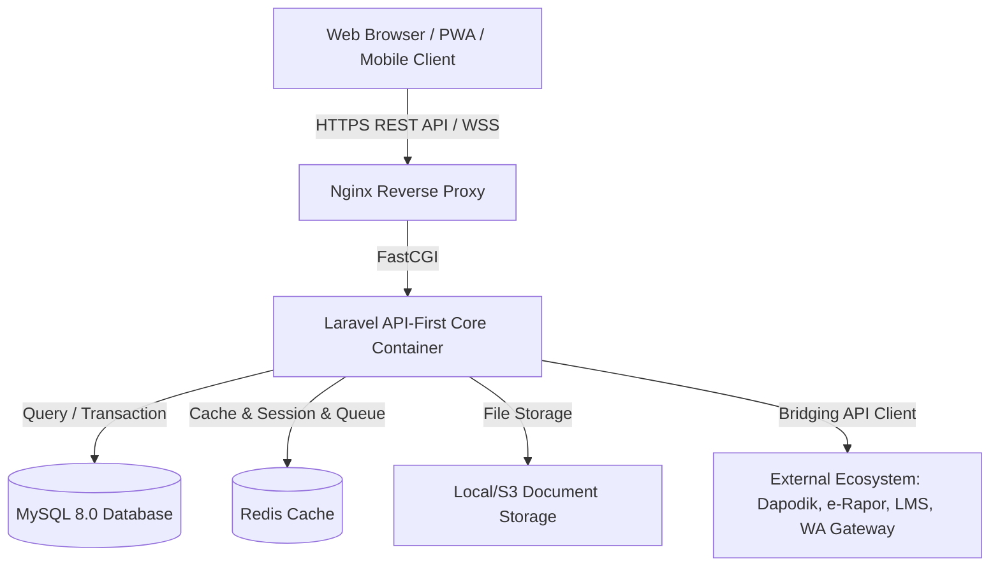
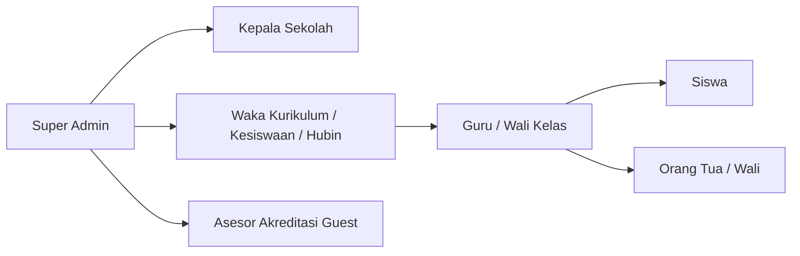
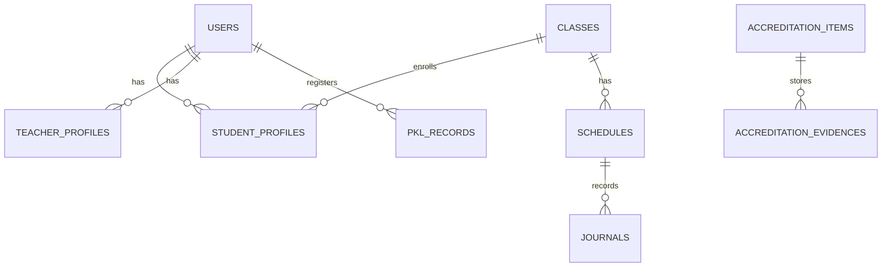

# 🎨 INFORA Design & Architecture Specification
> **Information Network for Organization, Records, & Accreditation**  
> *"Era Baru Sistem Informasi Sekolah Menengah (SMA & SMK)"*

---

## 1. 🌟 Ringkasan Eksekutif (Executive Summary)

**INFORA** adalah platform web Sistem Informasi Manajemen (SIM) sekolah menengah modern berbasis cloud yang dirancang untuk **SMA** dan **SMK**. INFORA menghadirkan ekosistem terpadu yang mengintegrasikan tata kelola akademik, kesiswaan, kepegawaian (GTK), hubungan industri & magang PKL (khusus SMK), hingga otomasi pemenuhan instrumen akreditasi sekolah unggul (BAN-SM / IASP).

---

## 2. 🎨 Identitas Visual & Desain Sistem (Brand & UI/UX System)

### 2.1. Brand Identity
- **Nama Platform:** INFORA
- **Tagline:** Era Baru Sistem Informasi Sekolah Menengah
- **Brand Personality:** Modern, Sleek, Intelligent, Reliable, Student & Teacher Friendly.

### 2.2. Palet Warna (Color Palette)
| Token | Kode Warna | Penggunaan |
| :--- | :--- | :--- |
| **Primary Base** | `#0B132B` | Dark Slate Background, Navbar, Header Kontras |
| **Primary Surface** | `#1C2541` | Card Background, Sidebar Container |
| **Accent Electric Cyan** | `#00D2FF` | Active States, Data Sync Indicators, Primary Buttons |
| **Accent Royal Blue** | `#3A7BD5` | Gradient Fill, Chart Data, Interactive Elements |
| **Accent Aurora Purple**| `#8A2BE2` | Highlight Badges, Status Akreditasi Unggul |
| **Success Emerald** | `#10B981` | Status Kelulusan / Verifikasi, Validasi Dokumen |
| **Warning Amber** | `#F59E0B` | Keterlambatan Berkas, Peringatan Kelengkapan Dokumen |
| **Danger Rose** | `#EF4444` | Pelanggaran Disiplin, Peringatan Sistem |
| **Text Primary** | `#0F172A` / `#F8FAFC` | Dark / Light Mode Primary Text |
| **Text Muted** | `#64748B` / `#94A3B8` | Subtitle, Metadata, Timestamp |

### 2.3. Tipografi
- **Headings & Display:** `Plus Jakarta Sans` / `Outfit` (Modern, geometric, bold, dan ramah).
- **Body & Data Tables:** `Inter` (Tingkat keterbacaan tinggi untuk tabel nilai, jadwal, dan data akreditasi).
- **Monospace (ID Siswa/NISN/Kode):** `JetBrains Mono` / `Fira Code`.

### 2.4. Prinsip UI/UX & Arsitektur Layout
1. **Dedicated Layout Separation (Desktop vs Mobile):** Menggunakan pemisahan master layout secara terpisah (misal `layouts/desktop.blade.php` dan `layouts/mobile.blade.php`), bukan sekadar menyembunyikan elemen via CSS (`hidden md:block`). Pendekatan ini menjaga ukuran DOM tetap ramping dan interaksi terasa native.
2. **Mobile First Experience:** Antarmuka ponsel pintar dirancang dengan *bottom bar navigation*, ramah gestur sentuh (touch target minimal 44px), dan kecepatan interaksi instan (<300ms) untuk guru dan siswa.
3. **Desktop Power-Dashboard:** Menyajikan tata letak *high-density data* untuk staf administrasi, pimpinan sekolah, dan asesor akreditasi dengan *sidebar* navigasi fleksibel, tabel analitik bervolume besar, dan visualisasi grafik komprehensif.
4. **Role-Adaptive Interface:** Tampilan menu dan widget otomatis beradaptasi sesuai peran pengguna yang login.
5. **Reusable Global CSS Classes (Strict No Ad-Hoc Classes):** Seluruh styling antarmuka dikembangkan menggunakan nama class CSS global terstruktur dan reusable. Dilarang keras membuat class CSS khusus/ad-hoc sekali pakai, dilarang menggunakan *inline style* (`style="..."`), dan dilarang menyisipkan tag `<style>` di dalam berkas Blade view. Seluruh kustomisasi UI wajib didaftarkan sebagai class reusable melalui berkas stylesheet terpusat (`resources/css/`).

---

## 3. 🏛️ Arsitektur Sistem & Tech Stack

### 3.1. Core Stack
- **Architecture Pattern:** Modular Monolith (Domain-Driven Modules) & API-First Bridging
- **Data Response Contract:** Strict Pure JSON (`application/json`), Eloquent API Resources (Zero HTML in Data Payloads)
- **Backend Framework:** Laravel (Versi Terbaru / Latest Version)
- **Frontend Stack:** Blade + Alpine.js / Vue.js + Vanilla CSS & TailwindCSS (Mobile-First Architecture & Dedicated Layouts)
- **Database:** MySQL 8.0 / MariaDB
- **Caching & Real-time Queue:** Redis (untuk antrian pemrosesan dokumen akreditasi & notifikasi)
- **Containerization:** Docker & Docker Compose (Nginx, PHP-FPM, MySQL, Node.js)

---

## 4. 👥 Manajemen Peran & Hak Akses (Role-Based Access Control)

INFORA memiliki 7 tingkatan peran pengguna:

1. **Super Admin (Tata Usaha/IT):** Manajemen sistem penuh, backup data, konfigurasi sekolah, master user.
2. **Kepala Sekolah (Executive Dashboard):** Ringkasan keterlaksanaan KBM real-time, grafik performa akademik, audit mutu akreditasi.
3. **Waka Kurikulum & Kesiswaan:** Manajemen jadwal, kurikulum (Merdeka/K13), rekap pelanggaran & prestasi.
4. **Waka Hubin (Khusus SMK):** Manajemen kemitraan DUDI, ploting tempat PKL, monitoring jurnal magang.
5. **Guru & Wali Kelas:** Penginputan jurnal KBM, evaluasi materi kelas, rekap capaian akademik, input nilai rapor.
6. **Siswa & Orang Tua:** Akses jadwal, portofolio karya/prestasi, catatan BK, notifikasi agenda sekolah via WhatsApp/Email.
7. **Asesor Akreditasi (Guest Auditor):** Akses baca khusus ke Bank Dokumen & Bukti Fisik Akreditasi.

---

## 5. 🧩 Modul Fungsional Platform

### 5.1. Modul 1: Manajemen Akademik & Kesiswaan (SMA & SMK)
- Manajemen Tahun Ajaran, Semester, Rombel/Kelas, dan Mata Pelajaran.
- Pembagian Konsentrasi Keahlian (SMK) dan Peminatan/Fase (SMA).
- Jurnal Mengajar Digital Guru & Catatan BK (Bimbingan Konseling).
- Poin Pelanggaran Disiplin & Portofolio Prestasi Siswa.

### 5.2. Modul 2: Vokasi & Link-and-Match Industri (Khusus SMK)
- Database Rekanan Industri (DUDI).
- Manajemen PKL / Prakerin: Ploting siswa, pembimbing industri, jurnal harian magang digital.
- Penelusuran Tamatan (*Tracer Study*) & Bursa Kerja Khusus (BKK).

### 5.3. Modul 3: Akreditasi & Penjaminan Mutu Otomatis (BAN-SM / IASP)
- **Dashboard Kesiapan Akreditasi:** Mengukur persentase kelengkapan bukti fisik berdasarkan 4 komponen utama IASP:
  1. Mutu Lulusan (Kedisiplinan rekam jejak kesiswaan, portofolio prestasi, rekam jejak BKK).
  2. Proses Pembelajaran (Jurnal KBM guru, keaktifan siswa).
  3. Mutu Guru (Sertifikasi, keterlaksanaan jurnal KBM pendidik, karya inovasi).
  4. Manajemen Sekolah (Tata kelola transparan, sarana prasarana).
- **Bank Dokumen Digital:** Penyimpanan terstruktur SK, RPP/Modul Ajar, dan arsip kegiatan yang siap diunduh sekali klik saat visitasi.

---

## 6. 🗄️ Rancangan Skema Basis Data Inti (Database Schema Highlights)

### Tabel-Tabel Kunci:
1. `users`: Autentikasi, peran, status aktif, username/email/no_hp.
2. `students` & `teachers`: Profil lengkap, NISN/NIP, biodata, foto profil.
3. `classes` & `majors`: Struktur rombel dan jurusan/peminatan (TKJ, RPL, IPA, IPS, dll.).
4. `schedules` & `journals`: Jadwal mata pelajaran dan catatan jurnal KBM harian guru.
5. `internships` (PKL): Data penempatan industri, guru pembimbing, nilai instruktur industri.
6. `accreditation_evidences`: Dokumen bukti fisik terhubung ke butir standar akreditasi.

---

## 7. 🔒 Keamanan & Skalabilitas (Security & Performance)
- **Role-Based Token Middleware:** Laravel Sanctum / Spatie Permission untuk otorisasi API & Web route.
- **Rate Limiting & Throttling:** Perlindungan endpoint sensitif dan form submit dari serangan brute force.
- **Input Sanitization & CSRF:** Proteksi bawaan terhadap serangan SQL Injection, Cross-Site Scripting (XSS), dan CSRF.
- **Base64 Media Upload Pipeline & Naming Standard:** Pengunggahan foto dokumentasi menggunakan Base64 di payload JSON (maksimal 1MB per berkas) dengan optimasi kompresi agar kualitas gambar bukti fisik tetap jernih dan tajam. Seluruh berkas tersimpan wajib mengikuti format penamaan semantik: `{modul}_u{user_id}_{YYYYMMDD_His}_{random_8char}.{ekstensi}` (contoh: `kbm_u7_20260905_143022_a7b9c1d2.webp`).
- **Automated Daily Backup:** Pencadangan basis data dan dokumen digital secara terjadwal.

---

## 📚 8. Rujukan Dokumen Terkait
- 📖 **[README.md](../README.md):** Gambaran umum proyek dan panduan quick start Docker.
- 📋 **[TODO.md](TODO.md):** Roadmap tahapan implementasi dari Fase 1 hingga Fase 6.
- 🖼️ **[BRANDING.md](docs/BRANDING.md):** Filosofi penamaan brand, aset logo lockup, dan app icon.
