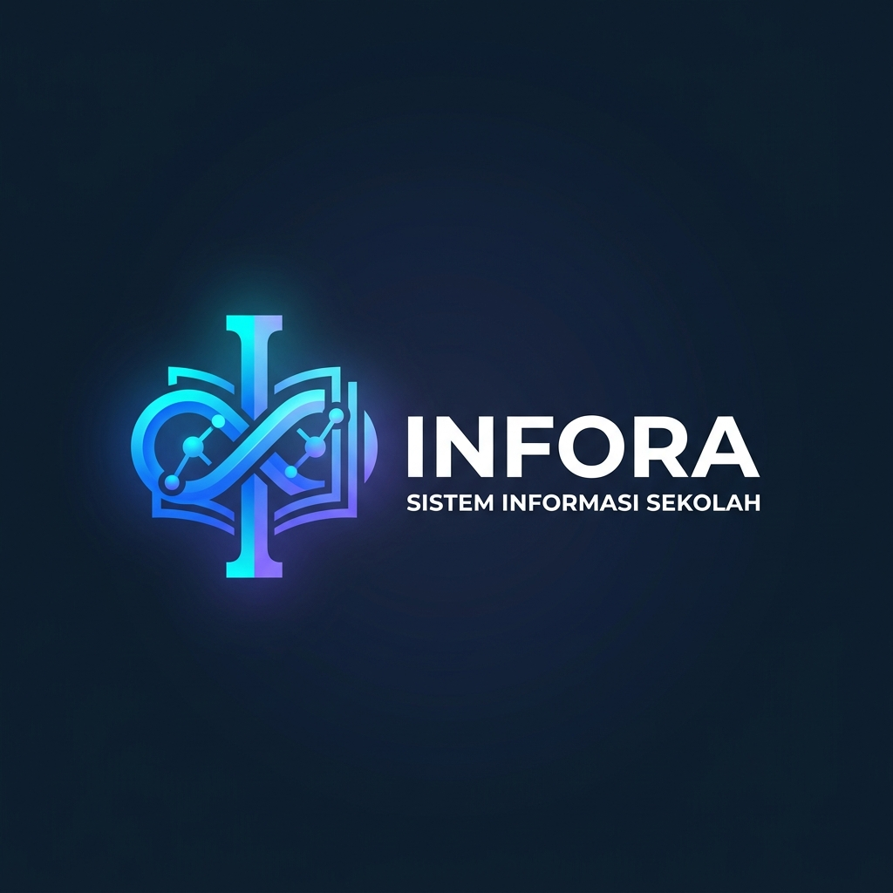
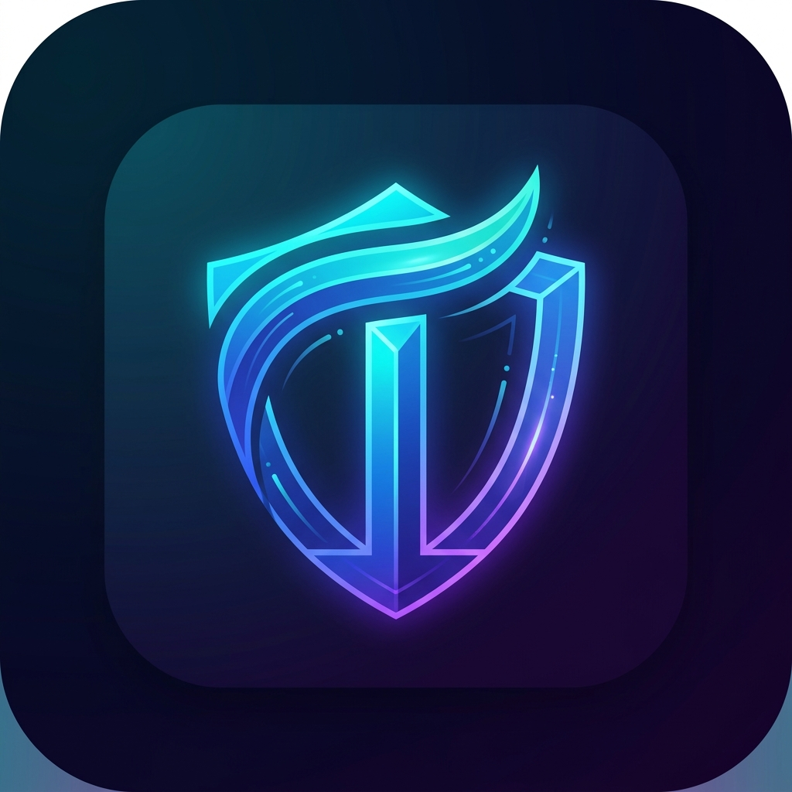

# 🎨 Identitas Brand & Konsep INFORA

Dokumentasi lengkap mengenai penamaan, filosofi, logo, dan identitas visual platform **INFORA**.

---

## 🏷️ 1. Penamaan & Konsep Utama

| Komponen | Penjelasan |
| :--- | :--- |
| **Nama Platform** | **INFORA** *(atau INFORA.ID / INFORA Web)* |
| **Kepanjangan / Konsep** | **INFOR**mation Network for **O**rganization, **R**ecords, & **A**ccreditation |
| **Etimologi Kata** | Gabungan dari **Information** (Sistem Informasi Sekolah) + **Era / Aurora** (Era Baru Pendidikan Digital & Fajar Kemajuan). |
| **Tagline Utama** | *"Era Baru Sistem Informasi Sekolah Menengah"* |
| **Sub-Tagline** | *"Satu Platform Cerdas untuk Tata Kelola Akademik, Vokasi, dan Akreditasi Unggul"* |
| **Target Satuan Pendidikan**| **SMA** (Sekolah Menengah Atas) & **SMK** (Sekolah Menengah Kejuruan) |

---

## 🖼️ 2. Aset Visual & Logo

Berkas gambar logo telah disimpan secara permanen di direktori proyek:
- 📌 **Full Logo Lockup:** [`detail/docs/branding/infora-logo.jpg`](branding/infora-logo.jpg)
- 📌 **App Icon / Favicon:** [`detail/docs/branding/infora-icon.jpg`](branding/infora-icon.jpg)

### Preview Logo & Icon:

*Gambar 1: INFORA Brand Logo (Untuk Header, Navbar, & Dokumen Resmi)*

*Gambar 2: INFORA App Icon (Untuk Favicon Web & Homescreen PWA Mobile)*

---

## 💡 3. Filosofi Desain Logo

1. **Pilar Huruf "I":** Melambangkan **Informasi**, **Integritas**, dan fondasi data sekolah yang kokoh.
2. **Buku Terbuka & Simpul Infinity:** Simbol pendidikan berkelanjutan serta aliran data akademik, nilai, dan dokumen yang tersinkronisasi tanpa henti (*real-time data flow*).
3. **Perisai Mutu (App Icon):** Melambangkan perlindungan kualitas mutu dan kesiapan menghadapi **Akreditasi Sekolah (BAN-SM / IASP)**.
4. **Gradasi Sky Blue, Royal Blue & Latar Bersih:**
   - **Sky Blue (`#0284C7`):** Kesegaran inovasi, ramah bagi guru & siswa, serta keterbukaan informasi.
   - **Royal Blue (`#2563EB`):** Kepercayaan institusi pendidikan, stabilitas, dan profesionalisme tata kelola.
   - **Latar Terang & Bersih (`#F8FAFC` & `#FFFFFF`):** Kemudahan membaca (*high readability*), ketenangan visual (*eye-friendly*), dan transparansi data sekolah.

---

## 📚 4. Rujukan Dokumen Terkait

- 🎨 **[DESIGN.md](../DESIGN.md):** Spesifikasi arsitektur teknis, sistem peran (RBAC), modul aplikasi, dan skema database.
- 📋 **[TODO.md](../TODO.md):** Roadmap tahapan implementasi dari Fase 1 hingga Fase 6.
- 📖 **[README.md](../../README.md):** Gambaran umum proyek dan panduan instalasi Docker.
